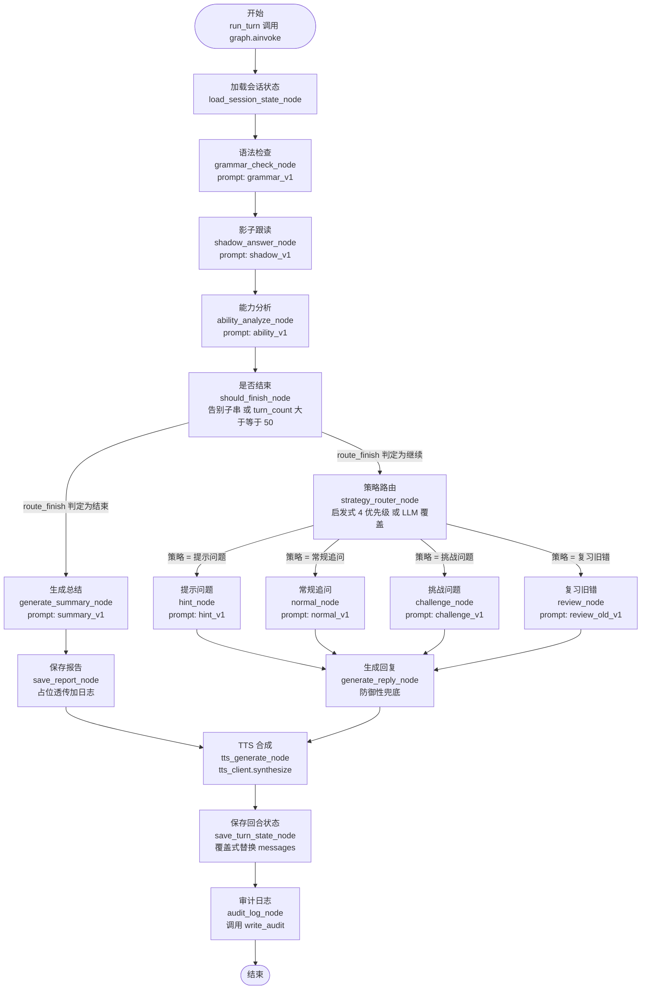

# SpeakCoach LangGraph 工作流图

```mermaid
flowchart TD
    START(["开始<br/>run_turn 调用 graph.ainvoke"])

    LOAD["加载会话状态<br/>load_session_state_node"]
    GRAM["语法检查<br/>grammar_check_node<br/>prompt: grammar_v1"]
    SHAD["影子跟读<br/>shadow_answer_node<br/>prompt: shadow_v1"]
    ABIL["能力分析<br/>ability_analyze_node<br/>prompt: ability_v1"]
    FIN["是否结束<br/>should_finish_node<br/>告别子串 或 turn_count 大于等于 50"]

    SR["策略路由<br/>strategy_router_node<br/>启发式 4 优先级 或 LLM 覆盖"]

    HINT["提示问题<br/>hint_node<br/>prompt: hint_v1"]
    NORM["常规追问<br/>normal_node<br/>prompt: normal_v1"]
    CHAL["挑战问题<br/>challenge_node<br/>prompt: challenge_v1"]
    REV["复习旧错<br/>review_node<br/>prompt: review_old_v1"]

    REPLY["生成回复<br/>generate_reply_node<br/>防御性兜底"]

    TTS["TTS 合成<br/>tts_generate_node<br/>tts_client.synthesize"]

    SUM["生成总结<br/>generate_summary_node<br/>prompt: summary_v1"]
    REP["保存报告<br/>save_report_node<br/>占位透传加日志"]

    STS["保存回合状态<br/>save_turn_state_node<br/>覆盖式替换 messages"]

    AUD["审计日志<br/>audit_log_node<br/>调用 write_audit"]
    END(["结束"])

    START --> LOAD
    LOAD --> GRAM --> SHAD --> ABIL --> FIN

    FIN -->|"route_finish 判定为结束"| SUM
    SUM --> REP --> TTS

    FIN -->|"route_finish 判定为继续"| SR
    SR -->|"策略 = 提示问题"| HINT
    SR -->|"策略 = 常规追问"| NORM
    SR -->|"策略 = 挑战问题"| CHAL
    SR -->|"策略 = 复习旧错"| REV

    HINT --> REPLY
    NORM --> REPLY
    CHAL --> REPLY
    REV --> REPLY
    REPLY --> TTS
    TTS --> STS --> AUD --> END
```
